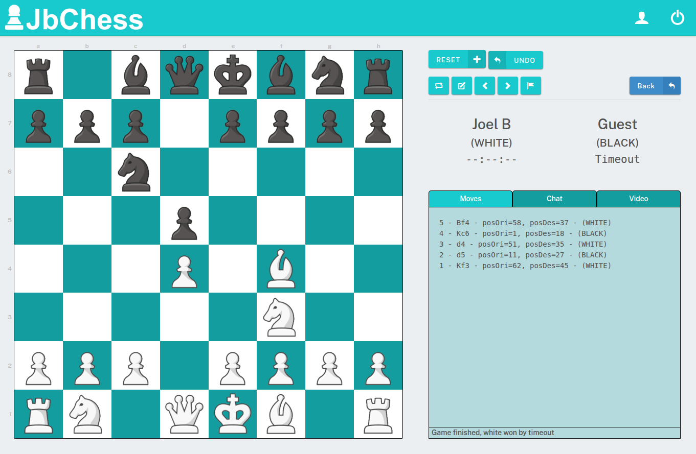
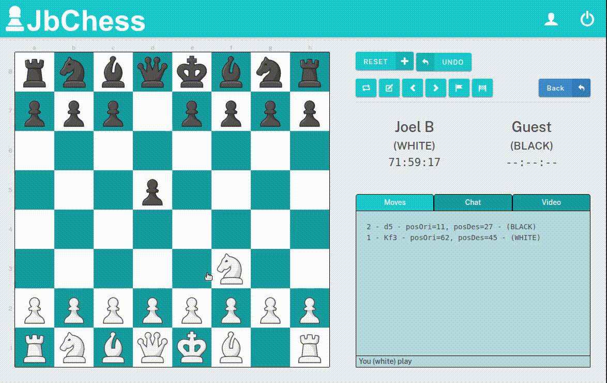
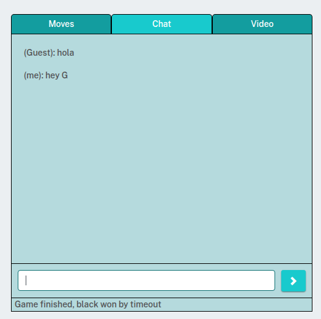
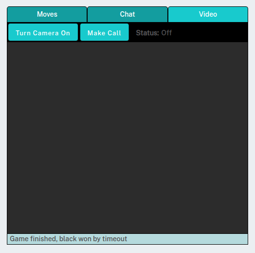

# JB-Chess

Web app to play chess online<br/>
<br/>
As an Chess player, I wanted to take the challenge to code a chess game + post it online so I can play with my friends.




## Backend Support

This project works with **Firebase** (Google Cloud), using its real time DB (Firestore).<br/>

## Structure

The game works as a state machine, saving the current game state in the real time DB so players get updates immediately.

The app uses NgXS to keep the profile status.

### Game Engine

To encode the game status, we use an array that represents all possitions on the grid, with numeric values representing what piece is planced in every position (0 = empty):
```
//   R   Kn  B   Q   K   B   Kn  R            R   Kn  B   Q   K   B   Kn  R
//   ----------------------------------------------------------------------
//   25, 26, 27, 28, 29, 30, 31, 32,  | 0 |  00  01  02  03  04  05  06  07
//   17, 18, 19, 20, 21, 22, 23, 24,  | 1 |  08  09  10  11  12  13  14  15
//   0,  0,  0,  0,  0,  0,  0,  0,   | 2 |  16  17  18  19  20  21  22  23
//   0,  0,  0,  0,  0,  0,  0,  0,   | 3 |  24  25  26  27  28  29  30  31
//   0,  0,  0,  0,  0,  0,  0,  0,   | 4 |  32  33  34  35  36  37  38  39
//   0,  0,  0,  0,  0,  0,  0,  0,   | 5 |  40  41  42  43  44  45  46  47
//   1,  2,  3,  4,  5,  6,  7,  8,   | 6 |  48  49  50  51  52  53  54  55
//   9, 10, 11, 12, 13, 14, 15, 16,   | 7 |  56  57  58  59  60  61  62  63
//   ----------------------------------------------------------------------
//   R  Kn   B   Q   K   B  Kn   R            R  Kn   B   Q   K   B  Kn   R
```

Every piece has a code from 1 to 32 (1-16 white, 17-32 black).

<hr>

The most important part of the game is the function that checks all possible valid moves from a given state for a specific piece: [store.service.ts#L336](./src/app/core/store/store.service.ts#L336)
```
  // It returns an array with all possible moves a single piece can make at the current state
  // Every move contains: {
  //    posOri --> original position of the moving piece
  //    posDes --> destination position of the moving piece
  //    piece ---> object with the moving piece ({ code, color, name })
  //    takes ---> the piece that is being taken (if any. if none, 0)
  //    note ----> official notation text for the move
  //    nextBoard --> The game.board[] array after the move
  // }
  getValidMoves = (game, posOri, fullCheck = true) => { ... }
```

## Features
The game is as intuitive as chess.com.<br/>

When it's your turn, you can select any of your pieces to move, and the positions where the selected piece can move to will be highlighted with a dot. You select the destination position, and the move is made.



### Timers
Every player has a timer to make their move. If someone's time reaches 0, he/she loses the game.

### Moves
A right-side panel shows all the moves of the current game so far.
The moves are in standard notation (https://en.wikipedia.org/wiki/Algebraic_notation_(chess)#Notation_for_moves), generated in [store.service.ts#L569](./src/app/core/store/store.service.ts#L569)

### Chat
An aditional tab for a regular chat is also available on the right-side panel.


### Videochat
There is also an aditional tab for a video chat on the right-side panel.


It uses a WebRTC client, but there are no `STUN servers` configured, so it may not work well if you are behind a NAT.


## ToDos
The game is playable, but the app is far from production ready. Most of the UI should be cleaned up, and admin buttons hidden.

## Further help
This project was developed with [Angular](https://angular.dev/) version 11.0.5.
You can leave some comments on the project or contact [me](mailto:joel.barba.vidal@gmail.com) directly for more information.